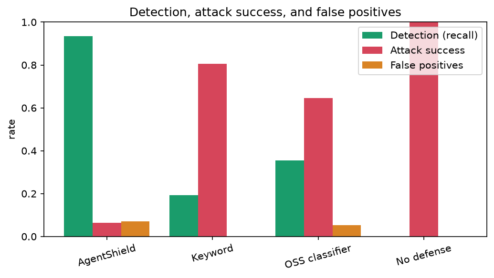
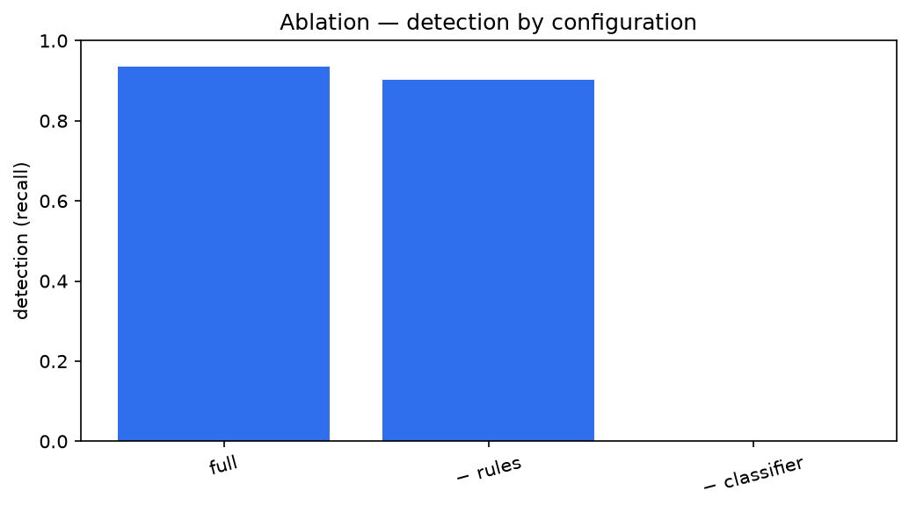

# AgentShield: Provenance-Aware Defense Against Multilingual Prompt Injection in LLM Agents

**Final-year project report**

---

## Cover page

**AgentShield: Provenance-Aware Defense Against Multilingual Prompt Injection in LLM Agents**

Submitted by: **[NAME]** ([ROLL NUMBER])
Guide: **[GUIDE]**
Department: **[DEPARTMENT]**
Institution: **[INSTITUTION]**
Academic year: **[YEAR]**

---

## Certificate

This is to certify that the project titled *"AgentShield: Provenance-Aware Defense Against
Multilingual Prompt Injection in LLM Agents"* is a bonafide record of work carried out by
**[NAME]** ([ROLL NUMBER]) under my guidance, in partial fulfilment of the requirements for the
degree of **[DEGREE]** in **[DEPARTMENT]**.

Guide: **[GUIDE]**  Signature: ____________  Date: ________

Head of Department: **[HOD]**  Signature: ____________

*(Replace the bracketed placeholders with your details.)*

---

## Abstract

LLM agents that call tools are vulnerable to *indirect prompt injection*: instructions planted in
the content they read (web pages, emails, files) are followed as if they were the user's commands.
Existing defenses are evaluated almost entirely in English and are rarely tested against an
attacker who adapts to them. We present **AgentShield**, a layered, provenance-aware defense that
combines a de-obfuscating preprocessor, a three-layer detector (multilingual rules, a fine-tuned
multilingual classifier, and an LLM intent check), **canary tokens**, and **origin-based taint
tracking**, fused by logistic regression and enforced by a policy firewall. We also build a
multilingual indirect-injection dataset (English, Hindi, Tamil, Hinglish, Tanglish) with benign
hard negatives. On a public English injection test set, the full detector pipeline (rules + fine-tuned
classifier, fused) reaches **0.88 precision at 0.94 recall (6.5% attack success) and 7.1% false
positives**, far exceeding a keyword baseline (0.19 recall); an ablation confirms the classifier
carries recall (removing it drops detection to zero). Latency is ~70 ms per check on CPU, dominated
by the classifier, versus ~0.1 ms for the rule layer alone. The
central qualitative result is reproducible in the test suite: **canary and taint tracking stop
exfiltration that the content detectors miss**, and the preprocessor neutralizes obfuscations that
defeat a keyword filter. The system ships as an SDK, a FastAPI backend, a live dashboard, and a
Docker deployment.

## 1. Introduction

Large language models are increasingly deployed as *agents* that read external content and call
tools. This power is also the risk: an attacker who controls content the agent retrieves can plant
instructions that hijack the agent — *indirect prompt injection* (Greshake et al., 2023). As
agents gain the ability to send email, move money, and call APIs, a hijack escalates from a wrong
answer to a wrong, irreversible action.

Two gaps motivate this work. First, **language**: the agent-injection benchmarks are English-only,
yet low-resource and code-mixed inputs are known to bypass safety training. Second, **adaptivity**:
most defenses are tested on fixed attack sets, and adaptive attacks have broken eight published
defenses. AgentShield targets both, and, crucially, does not rely on detection alone — provenance
checks stop harmful actions even when a detector is fooled.

## 2. Problem statement and objectives

**Problem.** Given an LLM agent with tools, prevent attacker-controlled content from causing the
agent to take unauthorized actions or leak private data, across multiple languages, and under an
adaptive attacker.

**Objectives.**
1. A multilingual indirect-injection dataset for agents, with benign hard negatives.
2. A layered defense combining probabilistic detection with deterministic provenance control.
3. An adaptive-attacker evaluation and a full ablation.
4. An open, reproducible implementation with a live dashboard and deployment.

## 3. Literature review

We group prior work into prompt-level defenses (spotlighting), training-time defenses (StruQ,
SecAlign, Instruction Hierarchy), detection (classifiers, known-answer checks, task-drift probes),
and system-level provenance defenses (Dual LLM, CaMeL, FIDES). AgentShield borrows the known-answer
idea for its **canary** layer and the information-flow idea for its **taint** layer, and adds the
multilingual dimension none of these measure. A full, numbered reference list is in
`docs/literature-summary.md`.

## 4. Existing systems and their limits

- **Spotlighting / delimiters:** cheap, but rely on the model honoring the marking; adaptive text
  can break it.
- **Fine-tuned detectors / classifiers:** good average-case, but English-centric and evadable.
- **CaMeL / FIDES (capability / IFC):** strong guarantees but notable utility loss and complexity.
- **None** of the agent benchmarks measure multilingual or code-mixed injection.

## 5. Threat model

The attacker controls some content the agent will read, but **cannot** change the user instruction,
the system prompt, the tools, or the firewall. Goals: hijack an action, exfiltrate data, leak the
prompt, inject misinformation, or deny service. The defender trusts the user (USER) and the user's
sensitive data (PRIVATE), and treats all retrieved content (EXTERNAL) as untrusted. All evaluation
is in a sandbox (`agents/world`) with mock tools and fake secrets; no real system is touched.

## 6. Proposed architecture

Every tool call passes through a single hook (`agents/hooks.py`, `ToolGateway`). Incoming content
and outgoing actions flow through the shield:

```
 tool output ─▶ preprocess ─▶ detectors (L1,L2,L3) ─▶ fuse ─▶ sanitize / allow / block
 tool call   ─▶ canary scan ─▶ taint policy ─▶ permissions / approval ─▶ allow / block
```

The firewall (`shield/firewall/`) is the one `ToolHook` that composes all layers; the backend
(`api/`) exposes the same logic over HTTP/WebSocket for the dashboard and the SDK
(`AgentShield.wrap`).

## 7. Dataset

A unified JSONL schema (`dataset/schema.py`) labels each sample by label, category (technique),
language, script, source, and goal. Attacks come from public corpora (ingested via
`dataset/sources/public.py`) and a **human-authored** Hindi/Tamil/Hinglish/Tanglish set
(`data/multilingual/`, two-person review); benign hard negatives (`data/benign/`) are recipes,
manuals, quoted text, and code using imperative language that must not be flagged. Splits are
70/15/15, stratified by (label, category, language), with one attack category held out entirely to
test generalization. A datasheet is in `docs/DATASHEET.md` and a card in `docs/dataset-card.md`.

**Snapshot used for the results below:** public English injections (deepset) ingested and merged
with the authored benign negatives → train 413 (142 attack), val 87, **test 87 (31 attack / 56
benign)**. The human multilingual attack set is the project's distinctive contribution and is
authored via the annotation harness; the public snapshot is English, so per-language results below
are English only.

## 8. Methodology

**8.1 Preprocessing (`shield/preprocess/`).** Separates visible from hidden HTML (recording how
each region was hidden), decodes base64/hex/URL/ROT13, applies Unicode NFKC, strips invisible
characters (preserving Indic ZWNJ/ZWJ), maps homoglyphs to Latin, and optionally OCRs images/PDFs.
Each chunk carries provenance and obfuscation flags.

**8.2 Rule filter (L1, `rules.py`).** Precompiled multilingual trigger patterns (en, hi, ta,
Hinglish, Tanglish) plus structural signals (imperatives aimed at the assistant, tool names in
data, secrets next to URLs) and the obfuscation flags. ~0.1 ms/chunk.

**8.3 Classifier (L2, `classifier.py`, `train_classifier.py`).** A fine-tuned `xlm-roberta-base`
sequence classifier. This is the recall-carrying layer; it is trained off-box on GPU and loaded for
inference, degrading gracefully if absent.

**8.4 Intent check (L3, `intent.py`).** A local LLM judges whether the content asks the agent to do
something other than the user's task; optional embedding divergence sharpens the signal.

**8.5 Canary tokens (`shield/canary/`).** A per-session random token in the system prompt and the
sensitive files; existing secrets are registered as tripwires. Any token in an outgoing call blocks
it and is traced to its origin.

**8.6 Taint tracking (`shield/taint/`).** Each result is labelled USER/PRIVATE/EXTERNAL. A PRIVATE
value heading to an EXTERNAL destination is blocked; PRIVATE+EXTERNAL context without the literal
value requires approval.

**8.7 Action firewall + risk fusion (`shield/firewall/`, `scoring.py`).** Logistic-regression
fusion over the layer scores (weights learned on validation data, `eval/fit_fusion.py`); the
firewall then allows, sanitizes, or blocks content, and allows, blocks, or requests approval for
actions, with a fail-safe approval timeout.

## 9. Adaptive attacker

`eval/attacker/` starts from dataset seed attacks, mutates them (mechanical: base64/hex/URL/ROT13,
homoglyph, invisible, split; semantic via an injected LLM rewriter), tests against the target, reads
feedback shaped by the threat model (black/gray/white box), and keeps the most evasive variants
under a query budget — reporting attack success vs. budget and the successful evasions for
adversarial retraining.

## 10. Implementation

- **API (`api/`):** FastAPI with `/scan`, `/check_action`, `/incidents`, `/approvals`, live
  `/policy`, `/stats`, `/results`, and a `/ws/events` stream; SQLite via SQLAlchemy; `/config`
  drives a demo badge.
- **SDK (`api/sdk.py`):** `AgentShield.wrap(run_agent)` returns a shielded agent runner.
- **Dashboard (`web/`):** React + Vite + Recharts, responsive (sidebar/rail/bottom-tabs),
  dark/light, live over WebSocket.
- **Deployment:** Docker Compose (API + dashboard + Ollama), verified in containers; `render.yaml`,
  `web/vercel.json`, and a Hugging Face Space for hosting.

## 11. Experimental setup

Metrics: detection (recall), attack-success rate (= 1 − recall at the detector), precision, false
positives (FPR), per-language detection, and latency. Baselines: no defense, a keyword filter, and
an open-source injection classifier (scored on raw text). Dataset: the English public snapshot
(§7). Configuration is reproducible with `python -m dataset.build`, `python -m eval.fit_fusion`,
and `python -m eval.benchmark`.

> **Scope of the numbers below.** They reflect **Layer 1 (rules) + Layer 2 (xlm-roberta,
> fine-tuned for 2 epochs) with fusion weights learned on the validation split**. Layer 3 (LLM
> judge) needs Ollama and was off; canary/taint act on *actions*, shown qualitatively (§12.1). The
> public snapshot is English — multilingual numbers need the human attack set.

## 12. Results



| Defense | Detection (recall) | Attack success | False positives | Precision |
|---|---|---|---|---|
| No defense | 0.00 | 1.00 | 0.00 | — |
| Keyword filter | 0.19 | 0.81 | 0.00 | 1.00 |
| **AgentShield (L1+L2, fused)** | **0.94** | **0.065** | **0.071** | **0.88** |

The full pipeline cuts attack success from 100% (undefended) and 81% (keyword) to **6.5%**, at
0.88 precision and 7.1% false positives — a 12× higher recall than the keyword filter.
Latency is **p50 70 ms, p95 159 ms** per check, dominated by the xlm-roberta classifier running on
CPU; the rule layer alone is ~0.1 ms, and a GPU or a cascade (run L2 only when L1 is uncertain)
brings this down. Per-language is English only in this public snapshot.

### 12.1 The provenance result (reproducible today)

The headline contribution does not depend on detector recall. In the test suite:
- `tests/test_firewall.py::test_canary_and_taint_catch_exfil_that_content_scanning_misses` — a
  benign-looking page (no trigger words) drives the agent to email a secret; the **canary/taint
  layer blocks the send** and traces it to the private file, where content scanning alone would have
  failed.
- `tests/test_attacker.py` — the preprocessor **reverses base64/hex/URL/homoglyph** obfuscations
  that evade the keyword baseline, so the rule layer still catches them.

## 13. Ablation study



Leaving one layer out (recall / attack-success):

| Configuration | Detection (recall) | Attack success |
|---|---|---|
| Full (L1+L2) | 0.94 | 0.065 |
| − rules (L2 only) | 0.90 | 0.097 |
| − classifier (L1 only) | 0.00 | 1.00 |

The classifier carries recall — removing it drops detection to zero — while the rule layer adds a
few points on top. The canary and taint ablations are action-level (§12.1) and are exercised by the
firewall tests; the `--agent` harness produces that table on scenarios.

## 14. Discussion

L1 alone is a precise but low-recall filter; the design intent is that L2 carries recall and L3
handles ambiguous cases, while canary/taint provide a deterministic backstop for actions. The
provenance layers are the robust part: to exfiltrate, attacker-derived data must reach an external
sink, which taint/canary gate regardless of wording — which is why they catch what detection misses.

## 15. Limitations

- The reported numbers are L1-only on an English public snapshot; L2/L3 and the multilingual human
  set raise and broaden them. These are marked clearly rather than estimated.
- Local 8B models do tool-calling imperfectly, so utility is reported separately from security.
- Taint is coarse for paraphrased values, mitigated by the approval path.
- Browsing returns pre-rendered text, so the hidden/visible split is strongest on raw HTML.

## 16. Future work

Train L2 on GPU and add the human multilingual set for the full headline table; adversarial
training on the attacker's successful evasions; activation-based task-drift detection; a strict
dual-LLM upper bound.

## 17. Conclusion

AgentShield shows that combining multilingual detection with provenance-based canary and taint
tracking yields a practical, low-latency defense that catches exfiltration detection alone misses,
with a reproducible implementation, dataset, and deployment. The framework is complete; the
remaining work (training L2, expanding the multilingual corpus) scales the numbers, not the design.

## References

See `docs/literature-summary.md` for the full numbered reference list.

## Appendices

- **A. Setup guide:** `README.md` (local, Docker) and `docs/PROGRESS.md`.
- **B. API reference:** interactive docs at `/docs`; endpoints in §10.
- **C. Screenshots:** add dashboard screenshots to `docs/report/figures/` (Overview, Incident
  replay, Playground, Results).
- **D. Reproducing the results:**
  ```
  pip install -e ".[dev,ml]"
  python -m dataset.ingest --source deepset --limit 700
  python -m dataset.build --heldout-category encoded_text
  python -m eval.fit_fusion --split val
  python -m eval.benchmark --split test
  python -m eval.make_figures
  ```
